---
## Front matter
title: "Отчёт по лабораторной работе №3"
subtitle: "Дисциплина: архитектура компьютера"
author: "Маньковская Дарья Станиславовна"

## Generic otions
lang: ru-RU
toc-title: "Содержание"

## Bibliography
bibliography: bib/cite.bib
csl: pandoc/csl/gost-r-7-0-5-2008-numeric.csl

## Pdf output format
toc: true # Table of contents
toc-depth: 2
lof: true # List of figures
fontsize: 12pt
linestretch: 1.5
papersize: a4
documentclass: scrreprt
## I18n polyglossia
polyglossia-lang:
  name: russian
  options:
	- spelling=modern
	- babelshorthands=true
polyglossia-otherlangs:
  name: english
## I18n babel
babel-lang: russian
babel-otherlangs: english
## Fonts
mainfont: PT Serif
romanfont: PT Serif
sansfont: PT Sans
monofont: PT Mono
mainfontoptions: Ligatures=TeX
romanfontoptions: Ligatures=TeX
sansfontoptions: Ligatures=TeX,Scale=MatchLowercase
monofontoptions: Scale=MatchLowercase,Scale=0.9
## Biblatex
biblatex: true
biblio-style: "gost-numeric"
biblatexoptions:
  - parentracker=true
  - backend=biber
  - hyperref=auto
  - language=auto
  - autolang=other*
  - citestyle=gost-numeric
## Pandoc-crossref LaTeX customization
figureTitle: "Рис."
listingTitle: "Листинг"
lofTitle: "Список иллюстраций"
lolTitle: "Листинги"
## Misc options
indent: true
header-includes:
  - \usepackage{indentfirst}
  - \usepackage{float} # keep figures where there are in the text
  - \floatplacement{figure}{H} # keep figures where there are in the text
---

1 Цель работы

Целью данной лабораторной работы является освоение процедуры оформления отчетов с помощью легковесного языка разметки Markdown.

2 Задание

    1. Установка необходимого ПО
    2. Заполнение отчета по выполнению лабораторной работы №4 с помощью языка разметки Markdown
    3. Задание для самостоятельной работы

3 Теоретическое введение

    Markdown - легковесный язык разметки, созданный с целью обозначения форматирования в простом тексте, с максимальным сохранением его читаемости человеком, и пригодный для машинного преобразования в языки для продвинутых публикаций. Внутритекстовые формулы делаются аналогично формулам LaTeX. В Markdown вставить изображение в документ можно с помощью непосредственного указания адреса изображения. Синтаксис Markdown для встроенной ссылки состоит из части [link text], представляющей текст гиперссылки, и части (file-name.md) – URL-адреса или имени файла, на который дается ссылка. Markdown поддерживает как встраивание фрагментов кода в предложение, так и их размещение между предложениями в виде отдельных огражденных блоков. Огражденные блоки кода — это простой способ выделить синтаксис для фрагментов кода.

4 Выполнение лабораторной работы

Открываю терминал. Перехожу в каталог курса, сформированный при выполнении прошлой лабораторной работы (рис. 1).
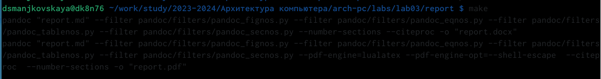                                                                      
Рис. 1. Перемещение между директориями  
                                   
Обновляю локальный репозиторий, скачав изменения из удаленного репозитория с помощью команды git pull (рис. 2).
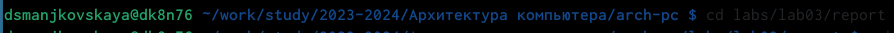                                                     
Рис. 2. Обновление локального репозитория                         

Перехожу в каталог с шаблоном отчета по лабораторной работе №3 с помощью cd (рис.3).
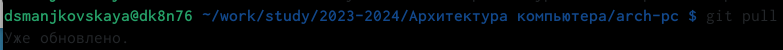                                   
Рис. 3. Перемещение между директориями                                

Компилирую шаблон с использованием Makefile, вводя команду make (рис. 4).
                                           
Рис. 4. Компиляция шаблона                             

Открываю сгенерированный файл report.docx LibreOffice  (рис. 5).
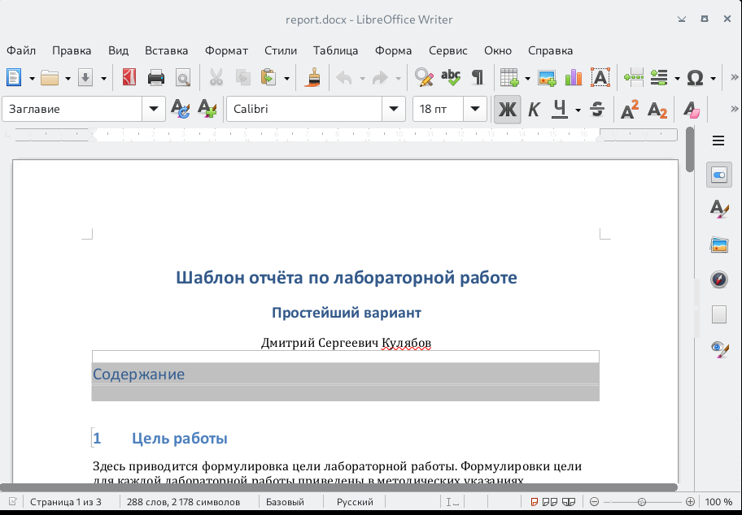                            
Рис. 5. Открытие файла docx                                     

Открываю сгенерированный файл report.pdf (рис. 6). Убедилась, что все правильно сгенерировалось.
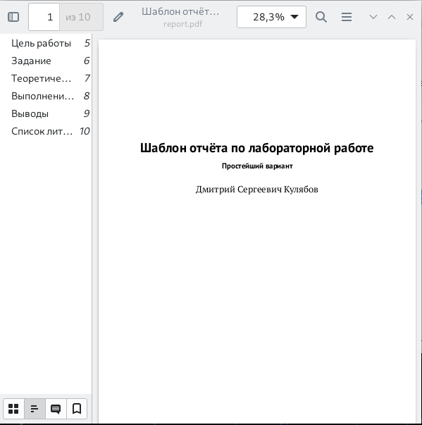             
Рис. 6. Открытие файла pdf                                   

Удаляю полученные файлы с использованием Makefile, вводя команду make clean (рис. 7). С помощью команды ls проверяю, удалились ли созданные файлы.
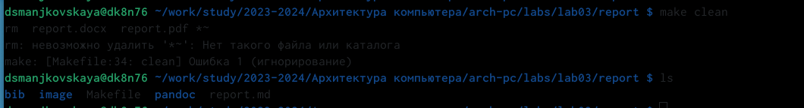                 
Рис. 7. Удаление файлов                          

Открываю файл report.md с помощью любого текстового редактора (рис. 8).
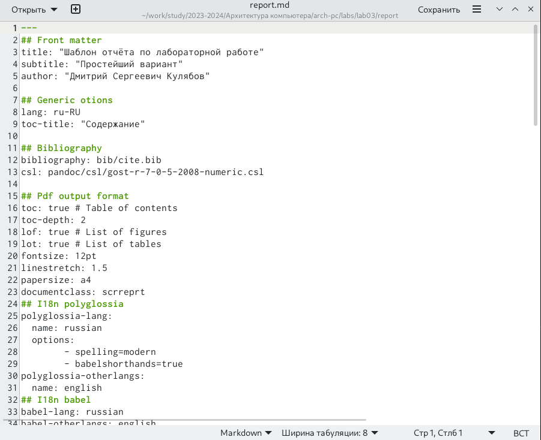                  
Рис. 8. Открытие файла md                                   

Я хочу, чтобы у меня на всякий случай сохранился шаблон отчета, поэтому копирую файл с новым названием с помощью утилиты cp (рис. 9).
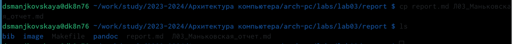                    
Рис. 9.  Копирование файла с новым именем                                      

Начинаю заполнять отчет с помощью языка разметки Markdown в скопированном файле (рис. 10).     
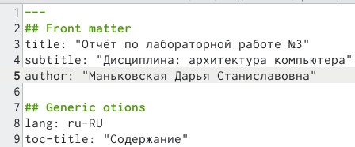                               
Рис. 10. Заполнение отчета                                           

Перехожу в директорию lab02/report с помощью cd, чтобы там заполнять отчет по третьей лабораторной работе (рис. 11).   
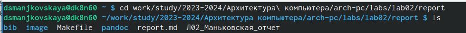                               
Рис. 11. Перемещение между директориями                                           

Копирую файл report.md с новым именем для заполненния отчета (рис. 12).                 
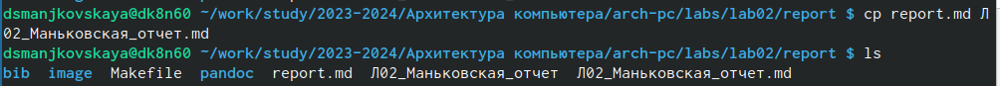                               
Рис. 12. Копирование файла                                           

Открываю файл с помощью текстового редактора mousepad и начинаю заполнять отчет (рис. 13).                 
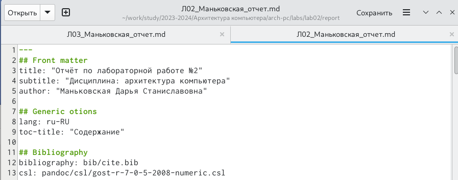                               
Рис. 13. Работа над отчетом                                           

Компилирую файл с отчетом по лабораторной работе (рис. 14).                 
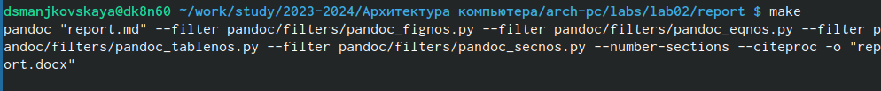                               
Рис. 14. Компиляция файлов                                           

Удаляю лишние сгенерированные файлы report.docx и report.pdf (рис. 15).                 
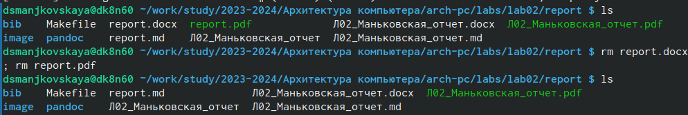                               
Рис. 15. Удаление лишних файлов                                           

Добавляю изменения на GitHub с помощью комнадой git add и сохраняю изменения с помощью commit (рис. 16).                 
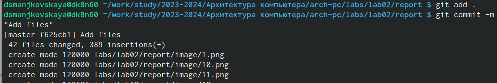                               
Рис. 16. Добавление файлов на GitHub                                           

Отправлялю файлы на сервер с помощью команды git pull(рис. 17).                 
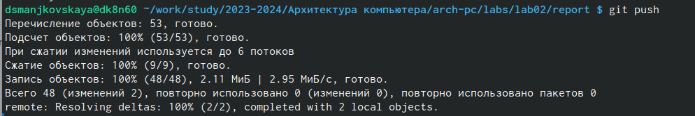                               
Рис. 17. Отправка файлов                                           

5 Выводы                                            

В результате выполнения данной лабораторной работы я освоила процедуры оформления отчетов с помощью легковесного языка разметки Markdown.

6 Список литературы

[Архитектура ЭВМ](https://esystem.rudn.ru/pluginfile.php/2089083/mod_resource/content/0/%D0%9B%D0%B0%D0%B1%D0%BE%D1%80%D0%B0%D1%82%D0%BE%D1%80%D0%BD%D0%B0%D1%8F%20%D1%80%D0%B0%D0%B1%D0%BE%D1%82%D0%B0%20%E2%84%963.%20%D0%AF%D0%B7%D1%8B%D0%BA%20%D1%80%D0%B0%D0%B7%D0%BC%D0%B5%D1%82%D0%BA%D0%B8%20.pdf)
