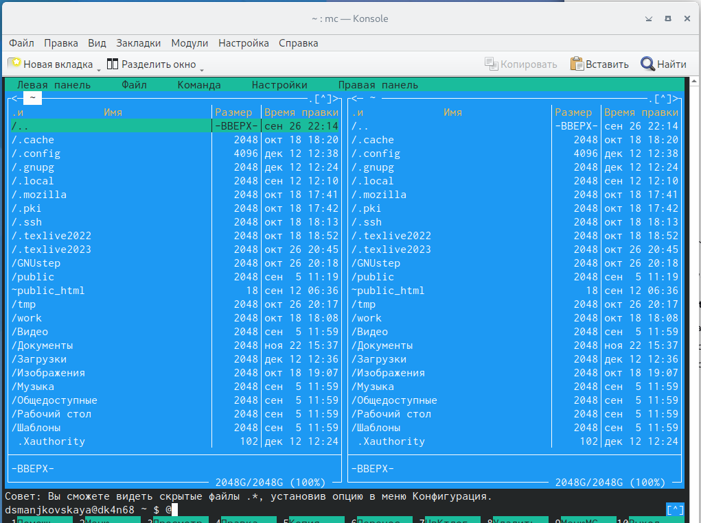
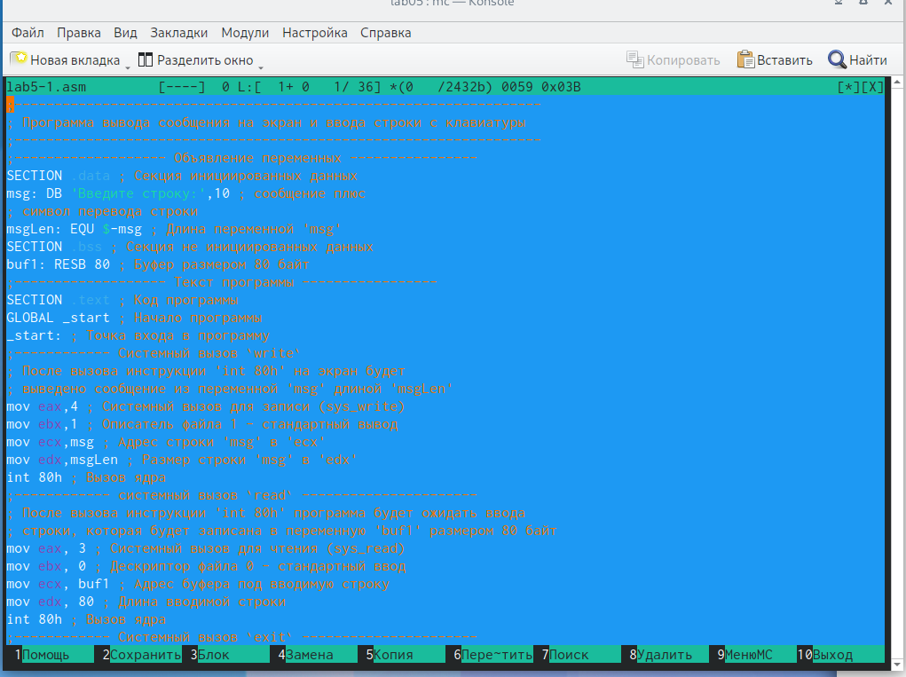
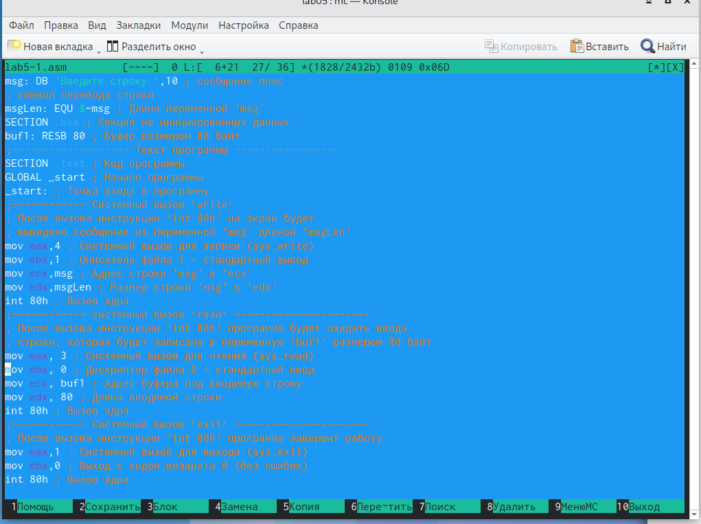
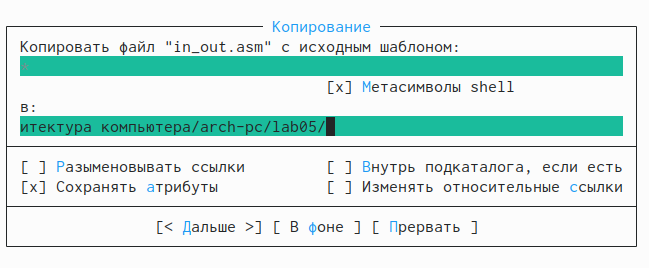
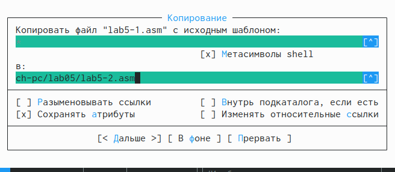
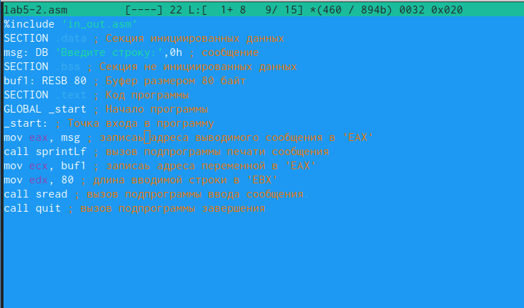
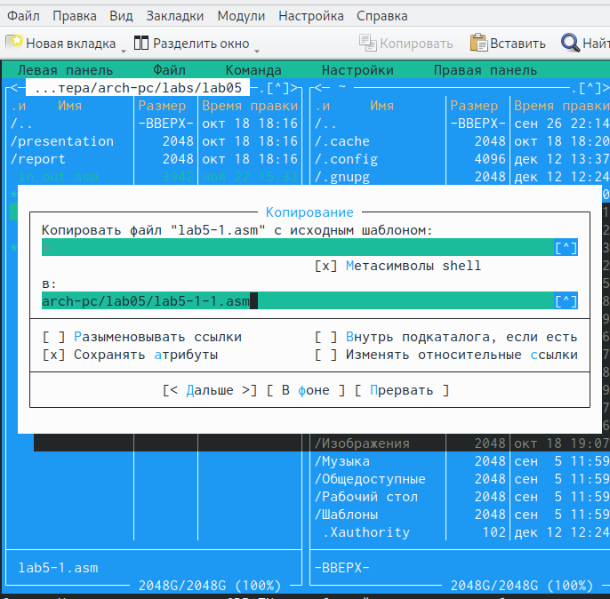
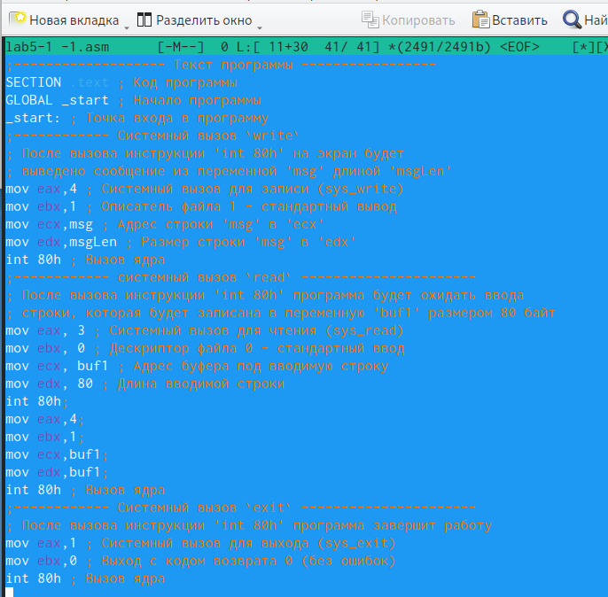
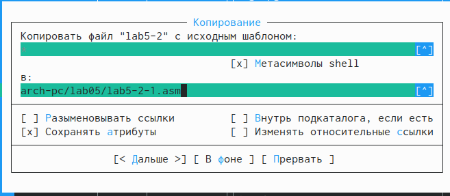

---
## Front matter
title: "Отчет по лабораторной работе №5"
subtitle: "Дисциплина: Архитектура компьютера"
author: "Маньковская Дарья Станиславовна"

## Generic otions
lang: ru-RU
toc-title: "Содержание"

## Bibliography
bibliography: bib/cite.bib
csl: pandoc/csl/gost-r-7-0-5-2008-numeric.csl

## Pdf output format
toc: true # Table of contents
toc-depth: 2
lof: true # List of figures
lot: true # List of tables
fontsize: 12pt
linestretch: 1.5
papersize: a4
documentclass: scrreprt
## I18n polyglossia
polyglossia-lang:
  name: russian
  options:
	- spelling=modern
	- babelshorthands=true
polyglossia-otherlangs:
  name: english
## I18n babel
babel-lang: russian
babel-otherlangs: english
## Fonts
mainfont: PT Serif
romanfont: PT Serif
sansfont: PT Sans
monofont: PT Mono
mainfontoptions: Ligatures=TeX
romanfontoptions: Ligatures=TeX
sansfontoptions: Ligatures=TeX,Scale=MatchLowercase
monofontoptions: Scale=MatchLowercase,Scale=0.9
## Biblatex
biblatex: true
biblio-style: "gost-numeric"
biblatexoptions:
  - parentracker=true
  - backend=biber
  - hyperref=auto
  - language=auto
  - autolang=other*
  - citestyle=gost-numeric
## Pandoc-crossref LaTeX customization
figureTitle: "Рис."
tableTitle: "Таблица"
listingTitle: "Листинг"
lofTitle: "Список иллюстраций"
lotTitle: "Список таблиц"
lolTitle: "Листинги"
## Misc options
indent: true
header-includes:
  - \usepackage{indentfirst}
  - \usepackage{float} # keep figures where there are in the text
  - \floatplacement{figure}{H} # keep figures where there are in the text
---

**1 Цель работы**

Целью данной лабораторной работы является приобретение практических
навыков работы в Midnight Commander, освоение инструкций языка ассемблера
mov и int.

**2 Задание**

1. Основы работы с mc
2. Структура программы на языке ассемблера NASM
3. Подключение внешнего файла
4. Выполнение заданий для самостоятельной работы

**3 Теоретическое введение**

Midnight Commander (или просто mc) — это программа, которая позволяет
просматривать структуру каталогов и выполнять основные операции по управ-
лению файловой системой, т.е. mc является файловым менеджером. Midnight
Commander позволяет сделать работу с файлами более удобной и наглядной. Про-
грамма на языке ассемблера NASM, как правило, состоит из трёх секций: секция
кода программы (SECTION .text), секция инициированных (известных во время
компиляции) данных (SECTION .data) и секция неинициализированных данных
(тех, под которые во время компиляции только отводится память, а значение
присваивается в ходе выполнения программы) (SECTION .bss). Для объявления
инициированных данных в секции .data используются директивы DB, DW, DD,
DQ и DT, которые резервируют память и указывают, какие значения должны
храниться в этой памяти: - DB (define byte) — определяет переменную разме-
ром в 1 байт; - DW (define word) — определяет переменную размеров в 2 байта
(слово); - DD (define double word) — определяет переменную размером в 4 байта
(двойное слово); - DQ (define quad word) — определяет переменную размером в
8 байт (учетве- рённое слово); - DT (define ten bytes) — определяет переменную
размером в 10 байт. Директивы используются для объявления простых перемен-
ных и для объявления массивов. Для определения строк принято использовать
директиву DB в связи с особенностями хранения данных в оперативной памяти.
Инструкция языка ассемблера mov предназначена для дублирования данных
источника в приёмнике.

mov dst,src

Здесь операнд dst — приёмник, а src — источник. В качестве операнда могут
выступать регистры (register), ячейки памяти (memory) и непосредственные
значения (const). Инструкция языка ассемблера intпредназначена для вызова
прерывания с указанным номером.

int n

Здесь n — номер прерывания, принадлежащий диапазону 0–255. При програм-
мировании в Linux с использованием вызовов ядра sys_calls n=80h (принято
задавать в шестнадцатеричной системе счисления).

**4 Выполнение лабораторной работы**

Открываю Midnight Commander, введя в терминал mc (рис. 1).                                       
                                   
Рис. 1: Открытый mc                     

Перехожу в каталог ~/work/study/2022-2023/Архитектура Компьютера/arch-pc,
используя файловый менеджер mc. Перехожу в каталог lab05 (рис. 2).                           
                     
Рис. 2: Перемещение между директориями                             

В строке ввода прописываю команду touch lab5-1.asm, чтобы создать файл, в
котором буду работать. С помощью функциональной клавиши F4 открываю созданный файл для редактирования в редакторе nano (рис. 3).
   
Рис. 3: Открытие файла для редактирования                       

Ввожу в файл код программы для запроса строки у пользователя (рис. 4).              
Далее выхожу из файла (Ctrl+X), сохраняя изменения (Y, Enter).           
                      
Рис. 4: Редактирование файла                    

С помощью функциональной клавиши F3 открываю файл для просмотра, чтобы
проверить, содержит ли файл текст программы. 

Транслирую текст программы файла в объектный файл командой nasm -f elf
lab6-1.asm. Создался объектный файл lab5-1.o. Выполняю компоновку объектного
файла с помощью команды ld -m elf_i386 -o lab5-1 lab5-1.o . Создался
исполняемый файл lab5-1.Запускаю исполняемый файл. Программа выводит строку “Введите строку:” и ждет ввода с клавиатуры, я ввожу свои ФИО, на этом программа заканчивает
свою работу (рис. 5).                                            
              
Рис. 5: Исполнение файла                  

Скачиваю файл in_out.asm со страницы курса в ТУИС. Он сохранился в каталог
“Загрузки” (рис. 6).          
               
Рис. 6: Скачанный файл                      

С помощью функциональной клавиши F5 копирую файл in_out.asm из каталога
Загрузки в созданный каталог lab05 (рис. 7).                  
           
Рис. 7: Копирование файла              

С помощью функциональной клавиши F5 копирую файл lab5-1 в тот же каталог,
но с другим именем, для этого в появившемся окне mc прописываю имя для
копии файла (рис. 8).                           
             
Рис. 8: Копирование файла                      

Изменяю содержимое файла lab5-2.asm во встроенном редакторе nano (рис. 9), чтобы в программе использовались подпрограммы из внешнего файла
in_out.asm.          
                                   
Рис. 9: Редактирование файла             

Транслирую текст программы файла в объектный файл командой nasm -f elf
lab5-2.asm. Создался объектный файл lab5-2.o. Выполняю компоновку объектного
файла с помощью команды ld -m elf_i386 -o lab5-2 lab5-2.o Создался исполняемый
файл lab5-2. Запускаю исполняемый файл (рис. 10).            
                     
Рис. 10: Исполнение файла                       

Открываю файл lab5-2.asm для редактирования в nano функциональной кла-
вишей F4. Изменяю в нем подпрограмму sprintLF на sprint. Сохраняю изменения
и открываю файл для просмотра, чтобы проверить сохранение действий (рис. 11).                              
                        
Рис. 11: Отредактированный файл                      

Снова транслирую файл, выполняю компоновку созданного объектного файла,
запускаю новый исполняемый файл (рис. 12).                          
                    
Рис. 12: Запуск исполняемого файла                     

Выполнение заданий для самостоятельной работы

Создаю копию файла lab5-1.asm с именем lab5-1-1.asm с помощью функци-
ональной клавиши F5 (рис. 13).                                  
                    
Рис. 13: Копирование файла                                     

С помощью функциональной клавиши F4 открываю созданный файл для ре-
дактирования. Изменяю программу так, чтобы кроме вывода приглашения и
запроса ввода, она выводила вводимую пользователем строку (рис. 14).                
                    
Рис. 14: Редактирование файла                    

Создаю объектный файл lab5-1-1.o, отдаю его на обработку компоновщику,
получаю исполняемый файл lab5-1-1, запускаю полученный исполняемый
файл. Программа запрашивает ввод, ввожу свои ФИО, далее программа
выводит введенные мною данные (рис. 15).                          
                    
Рис. 15: Исполнение файла                            

Создаю копию файла lab5-2.asm с именем lab5-2-1.asm с помощью функци-
ональной клавиши F5 (рис. 16).                              
                    
Рис. 16: Копирование файла                                  

С помощью функциональной клавиши F4 открываю созданный файл для ре-
дактирования. Изменяю программу так, чтобы кроме вывода приглашения и
запроса ввода, она выводила вводимую пользователем строку (рис. 17).                 
                    
Рис. 17: Редактирование файла                            

Создаю объектный файл lab5-2-1.o, отдаю его на обработку компоновщику,
получаю исполняемый файл lab5-2-1, запускаю полученный исполняемый
файл. Программа запрашивает ввод без переноса на новую строку, ввожу
свои ФИО, далее программа выводит введенные мною данные (рис. 18).           
                    
Рис. 18: Исполнение файла                          

**5 Выводы**

При выполнении данной лабораторной работы я приобрела практические
навыки работы в Midnight Commander, а также освоила инструкции языка ассем-
блера mov и int.

**6 Список литературы**

[Архитектура ЭВМ](https://esystem.rudn.ru/pluginfile.php/2089085/mod_resou/0/%D0%9B%D0%B0%D0%B1%D0%BE%D1%80%D0%B0%D1%82%D0%BE%D1%80%D0%BD%D0%B0%D1%8F%20%D1%80%D0%B0%D0%B1%D0%BE%D1%82%D0%B0%20%E2%84%965.%20%D0%9E%D1%81%D0%BD%D0%BE%D0%B2%D1%8B%20%D1%80%D0%B0%D0%B1%D0%BE%D1%82%D1%8B%20%D1%81%20Midnight%20Commander%20%28%29.%20%D0%A1%D1%82%D1%80%D1%83%D0%BA%D1%82%D1%83%D1%80%D0%B0%20%D0%BF%D1%80%D0%BE%D0%B3%D1%80%D0%B0%D0%BC%D0%BC%D1%8B%20%D0%BD%D0%B0%20%D1%8F%D0%B7%D1%8B%D0%BA%D0%B5%20%D0%B0%D1%81%D1%81%D0%B5%D0%BC%D0%B1%D0%BB%D0%B5%D1%80%D0%B0%20NASM.%20%D0%A1%D0%B8%D1%81%D1%82%D0%B5%D0%BC%D0%BD%D1%8B%D0%B5%20%D0%B2%D1%8B%D0%B7%D0%BE%D0%B2%D1%8B%20%D0%B2%20%D0%9E%D0%A1%20GNU%20Linux.pdf)
